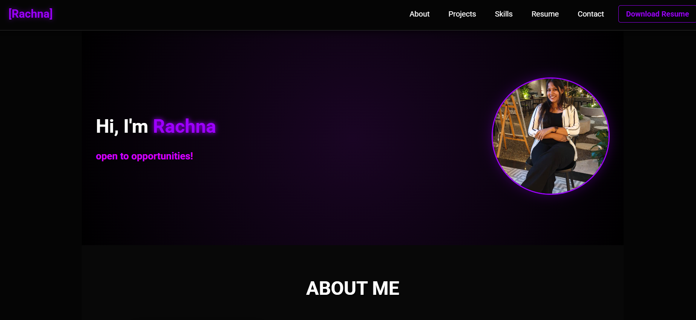

# Portfolio-using-HTML-CSS-JS

# ⚡ Rachna | Full Stack Developer Portfolio


> A futuristic, high-performance personal portfolio website featuring a **Neon Cyberpunk** aesthetic, interactive animations, and a seamless responsive design.


*(Note: Replace the image path above with a screenshot of your actual site once uploaded)*

## 🚀 Live Demo
**[Click here to view the live website] : https://portfolio-using-html-css-js-six.vercel.app/

---

## ✨ Key Features

### 🎨 Design & Aesthetics
*   **Neon Theme:** A deep dark mode base with Electric Purple (`#9d00ff`) and Hot Pink (`#d600ff`) accents.
*   **Light/Dark Toggle:** Fully functional theme switcher with Sun/Moon icons and distinct color palettes.
*   **Glassmorphism:** Frosted glass effects on skill cards and about sections.

### 🎬 Visual Effects (VFX)
*   **Floating Particles:** Subtle animated background particles moving upwards.
*   **Glitch Effect:** Cyberpunk-style text glitch animation on the hero name.
*   **Scroll Reveal:** Elements smoothly slide up and fade in as the user scrolls.
*   **Custom Cursor:** A glowing neon ring follows the mouse pointer (desktop only).
*   **Typing Effect:** Dynamic text animation in the hero section.

### 🛠 Functionality
*   **Responsive Layout:** Optimized for Desktops, Tablets, and Mobile phones.
*   **Lightbox Gallery:** Clickable certificates expand in a modal overlay.
*   **Contact Form:** Fully functional contact form powered by **Web3Forms** (No backend required).
*   **Live GitHub Stats:** Dynamic integration of GitHub activity.

---

## 🛠️ Tech Stack

*   **Frontend:** HTML5, CSS3 (Variables, Flexbox, Grid, Keyframe Animations), JavaScript (ES6+).
*   **Icons:** Font Awesome 6.5.
*   **Fonts:** Roboto (Google Fonts).
*   **Form Handling:** Web3Forms API.

---

## 📂 Folder Structure

```text
/
├── index.html          # Main HTML structure
├── style.css           # All styling, variables, and animations
├── script.js           # Logic for scroll spy, toggle, typing, and VFX
├── assets/             # Folder for Images and PDF Resume
│   ├── profile.png
│   ├── Rachna_Resume.pdf
│   └── ...
└── README.md           # Documentation
